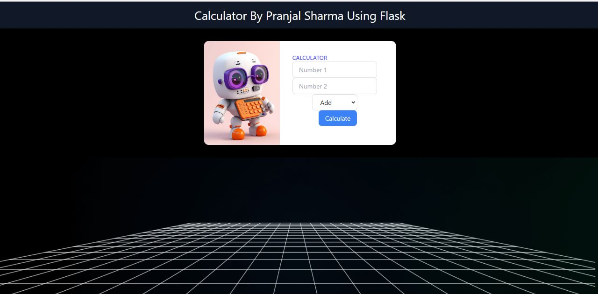

# Calculator Web App
## Link- https://calculator-2tlc.onrender.com/
# Simple Calculator Web Application

## Introduction

This is a simple calculator web application built with Flask as the backend framework. It provides basic arithmetic operations to perform calculations. Users can enter mathematical expressions in the input field and get the result displayed on the page.

## Features

- Addition, subtraction, multiplication, and division operations are supported.
- Error handling for invalid expressions or division by zero.
- User-friendly and responsive web interface.

## Prerequisites

Before you begin, ensure you have the following installed:

- Python 3.x: [Download Python](https://www.python.org/downloads/)
- pip package manager: [Installing pip](https://pip.pypa.io/en/stable/installing/)

## Installation

1. Clone the repository: `git clone [repository URL]`
2. Change to the project directory: `cd simple-calculator`
3. Create a virtual environment (optional but recommended): 
   - On macOS and Linux: `python3 -m venv venv`
   - On Windows: `py -m venv venv`
4. Activate the virtual environment:
   - On macOS and Linux: `source venv/bin/activate`
   - On Windows: `venv\Scripts\activate`
5. Install the required dependencies: `pip install -r requirements.txt`

## Usage

1. Run the application locally:
The application will be accessible at `http://localhost:5000`.

2. Enter a mathematical expression in the input field and press the "Calculate" button.
3. The result of the calculation will be displayed below the input field.
4. For example, to add two numbers, enter `2 + 3` and click "Calculate" to get the result `5`.

## Deployment

The application is deployed using Render, a cloud platform for hosting web applications. To deploy the application:

1. Sign up for a Render account at [https://render.com/](https://render.com/).

2. Create a new web service.
- Select "Web Service" as the type.
- Set the environment to "Python".
- Set the build command to `pip install -r requirements.txt && python app.py`.
- Set the start command to `python app.py`.
- Click "Create Web Service".

3. Connect the web service to your GitHub repository where the project is hosted.

4. Render will automatically deploy the application and provide a URL where you can access it.

## Contributing

We welcome contributions from the community! If you find any issues or want to add new features, feel free to open a pull request.

1. Fork the repository.
2. Create a new branch: `git checkout -b feature-name`
3. Make your changes and commit them: `git commit -m 'Add some feature'`
4. Push to the branch: `git push origin feature-name`
5. Open a pull request.

## License

This project is licensed under the [MIT License](LICENSE).

---

